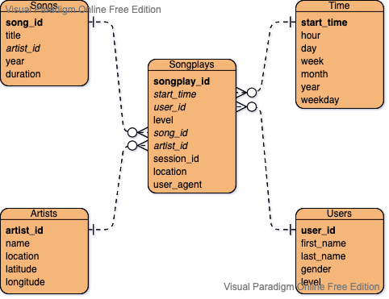

### Sparkify Database Analysis:
From what I see, there are 4 dimension tables (Users, Songs, Artists and Time) and 1 fact table (Songplays).
With this star schema and the information in the fact and dimension tables, Sparkify can do many aggregations and can come up with different KPIs that track the users favourit artists, total time listining to music on the application, total time listining from each user to each artist and many more ... 

Thanks to our cleaning & transformation pipeline that we implemented which will automate the data modelling and make it flowing smoothly to the data warehouse to be ready for analytical queries by their stakeholders.

### Running Python scripts:
The easiest way is to just call the python script from the terminal like `python etl.py`. However, in the reality, normally using Docker & Kubernetes to deploy such a pipeline on production, and maybe using Airflow for scheduling the pipeline if needed.

### Project Files Explanation:
The project consists of:
- a `data` directory which holds the data files for our application.
- the `etl.ipynb` notebook for creating something like PoC to check if this pipeline can be implemented on our data scale.
- the `sql_queries.py` file which holds all our SQL queries and DDL statements.
- the `create_tables.py` script which responsible for creating the database, dropping and creating tables (if not exist) by calling the DDL statements from `sql_queries.py` file.
- the `test.ipynb` file which holds the test units againest the modelled data layer that has been implemented.

### Database Schema Design & ETL Pipeline
The Entity-relationship diagram is as the following:

The star schema consists of 4 dimension tables and 1 fact table.  
Our pipeline steps are:
- loading data files from the data directory.
- filtering out unneeded columns.
- preparing and cleaning the dataframe.
- loading data into the database.
- testing and data validation

### Some Analytical Queries examples:
- How manu songs has each user listend?
`SELECT 
    user_id,
    u.first_name,
    u.last_name,
    COUNT(song_id) AS count_songs
FROM songplays sp
JOIN users u ON (u.user_id = sp.user_id)
GROUP BY 1, 2, 3
ORDER BY count_songs DESC
`

- What is the top song for each artist that has been played by each day of the week?
`SELECT 
    so.title AS song_title,
    ar.name AS artist_name
    ti.weekday,
    COUNT(*) count_plays
FROM songplays sp
JOIN songs so ON (so.song_id = sp.song_id)
JOIN artists ar ON (ar.artist_id = so.artist_id)
JOIN time ti ON (ti.start_time = sp.start_time)
GROUP BY 1, 2
ORDER BY count_plays DESC
`

## 2nd Submission: 
Thanks for your detailed review and your explanations, that was very helpful. 

I fixed the two issues and now everything should be fine. Thanks again!