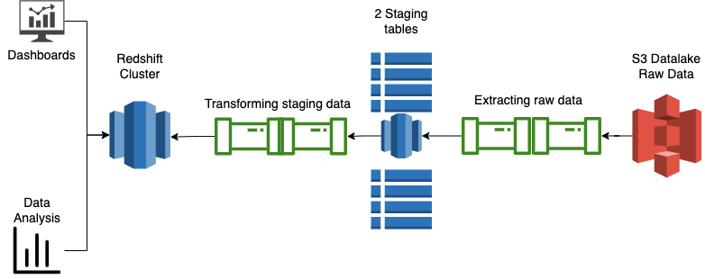

### Project Description:
Sparkify database has been growing dramastically recently, so the legacy tools and classic relational database couldn't fit to the dataset size. That's why in this project we provide a solution of building the data warehouse along with data pipelines on the cloud by using AWS. Raw data is stored on the data lake (AWS S3) in a json-like format. An automated ETL pipeline is created to extract the raw data from S3 to staging tables on Redshift, then transform and model it to a star-schema desgin, and then loading the data from the staging tables to the star-schema tables.
With this star schema and the information in the fact and dimension tables, Sparkify can do many aggregations and can come up with different KPIs that track the users favourit artists, total time listining to music on the application, total time listining from each user to each artist and many more ... 

### Running Python scripts:
The easiest way is to just call the python scripta from the terminal like `python etl.py`. However, in the reality, normally using Docker & Kubernetes to deploy such a pipeline on production, and maybe using Airflow for scheduling the pipeline if needed.

### Project Files Explanation:
The project consists of:
- `create_tables.py` script which responsible for creating the data infrastructure on AWS, then creating the database and creating tables by calling the DDL statements from `sql_queries.py` file.
- `etl.py` python script that holds the pipeline that extracting the data from the data lake and transforming it to fact and dimension tables as a star-schema design, then loading the data into these analytical data layer tables.
- `aws.py` holds one function for creating all the required services and connections in a right order on AWS
- `aws_helper.py` holds several functions that are needed for creating the whole infrastructure on AWS
- `sql_queries.py` file which holds all our SQL queries and DDL statements.
- `dwh.cfg` config file that holds all the configuration that is need for creating several services on the cloud.

### Database Schema Design & ETL Pipeline
Here is a simple chart that describes the full pipeline:

Here is the Entity-relationship diagram of the star schema tables:

The star schema consists of 4 dimension tables and 1 fact table.  
Our pipeline steps are:
- Creating appropriate resources and infrastrucre services on AWS.
- Extracting raw data files from the data lake on AWS S3.
- Loading the extracted raw data into staging tables on Redshift cluster.
- Creating a well-designed schema (fact & dimension tables) to act as an analytical data layer.
- Loading data from staging tables into the star-schema tables.
- Deleting resources on AWS.

### Some Analytical Queries examples:
- How manu songs has each user listend?
`SELECT 
    user_id,
    u.first_name,
    u.last_name,
    COUNT(song_id) AS count_songs
FROM songplays sp
JOIN users u ON (u.user_id = sp.user_id)
GROUP BY 1, 2, 3
ORDER BY count_songs DESC
`

- What is the top song for each artist that has been played by each day of the week?
`SELECT 
    so.title AS song_title,
    ar.name AS artist_name
    ti.weekday,
    COUNT(*) count_plays
FROM songplays sp
JOIN songs so ON (so.song_id = sp.song_id)
JOIN artists ar ON (ar.artist_id = so.artist_id)
JOIN time ti ON (ti.start_time = sp.start_time)
GROUP BY 1, 2
ORDER BY count_plays DESC
`